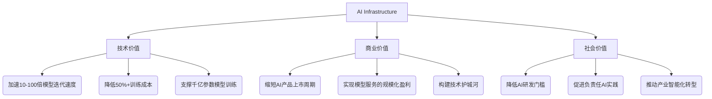

# 1.1 定义与范畴：什么是AI Infra？

## 一、AI基础设施的本质定义  

**AI基础设施（AI Infrastructure）** 是为人工智能工作负载提供全生命周期支撑的技术环境，它是由硬件、软件、网络和服务组成的**集成式技术栈**。其核心使命可概括为：  

> *“以可扩展、高效、可靠的方式，将原始数据转化为智能决策，并支撑AI模型从开发到生产的全流程。”*  

与传统IT基础设施的本质区别在于：AI Infra专为应对**计算密集型**（如大规模矩阵运算）、**数据密集型**（TB级数据集处理）和**通信密集型**（分布式训练）三大挑战而设计。  

## 二、AI工作负载的独特需求  
下表对比了传统应用与AI工作负载对基础设施的要求差异：  

| 维度         | 传统应用              | AI工作负载                  |  
|--------------|---------------------|---------------------------|  
| **计算模式**  | 事务处理（OLTP）      | 并行计算（SIMD/MIMD）       |  
| **数据特征**  | 结构化数据，GB级      | 多模态非结构化数据，TB/PB级 |  
| **硬件需求**  | 通用CPU              | GPU/TPU等加速器 + 高速互联 |  
| **延迟敏感度**| 毫秒级响应            | 训练：小时/天级；推理：毫秒级 |  
| **弹性要求**  | 稳态资源分配          | 突发性资源需求（如分布式训练）|  

## 三、AI基础设施的六大核心组件  

### 1. 算力引擎（Compute Engines）  
- **角色**：AI系统的“动力心脏”，执行模型训练与推理  
- **关键形态**：  
  - **异构计算集群**：CPU + GPU/TPU/FPGA的协同架构  
  - **专用加速器**：Tensor Core（NVIDIA）、Matrix Core（AMD）、TPU（Google）  
- **演进趋势**：从单卡训练 → 千卡级分布式训练 → 存算一体架构  

> *案例：GPT-4训练需约25,000个A100 GPU，算力需求相当于3.2万年单核CPU计算*

### 2. 数据供应链（Data Supply Chain）  
- **核心功能**：实现数据从湖仓到特征的高效流动  
- **技术栈分层**：  
  ```mermaid
  graph LR
  A[原始数据] --> B[数据湖存储 S3/HDFS]
  B --> C[特征工程 Spark/Dask]
  C --> D[特征存储 Feast/Tecton]
  D --> E[向量数据库 Milvus/Pinecone]
  ```  
- **关键挑战**：应对多模态数据（文本/图像/视频）的实时预处理与检索  

### 3. 模型工厂（Model Factory）  
- **构成要素**：  
  - **开发框架**：PyTorch/TensorFlow/JAX  
  - **模型仓库**：Hugging Face Hub / MLflow Model Registry  
  - **流水线工具**：Kubeflow Pipelines / MLflow Projects  
- **核心价值**：标准化模型从实验到部署的生命周期管理  

### 4. 调度中枢（Orchestration Core）  
- **核心能力**：智能化的资源分配与任务编排  
- **典型架构**：  
  ```python
  # 伪代码示例：分布式训练调度逻辑
  class AIScheduler:
      def allocate_resources(self, job):
          if job.type == "distributed_training":
              # 感知GPU拓扑与网络带宽
              nodes = topology_aware_placement(job.gpu_requirement)  
              # 配置NCCL通信参数
              set_nccl_parameters(nodes)  
          elif job.type == "realtime_inference":
              # 绑定NUMA节点减少延迟
              pin_to_numa_nodes()
  ```  
- **关键组件**：Kubernetes（容器编排）、Ray（分布式计算）、Slurm（HPC调度）  

### 5. 网络神经系统（Network Nervous System）  
- **核心指标**：低延迟（μs级）、高吞吐（100Gb/s+）、无损传输  
- **关键技术**：  
  | 技术          | 作用                          | 性能提升          |  
  |---------------|-----------------------------|------------------|  
  | RDMA/RoCE     | 绕过CPU直接内存访问            | 延迟降低10倍↑     |  
  | GPUDirect     | GPU间直接通信                 | 带宽利用率90%↑    |  
  | 智能网卡(DPU) | 卸载网络/存储协议处理           | CPU开销降低70%↓  |  

### 6. 可观测性工具链（Observability Stack）  
- **监控三维度**：  
  - **资源层**：GPU利用率、网络吞吐、存储IOPS  
  - **作业层**：训练迭代速度、推理延迟/吞吐  
  - **模型层**：数据漂移、精度衰减、公平性指标  
- **典型工具组合**：Prometheus（指标收集）+ Grafana（可视化）+ ELK（日志分析）  

## 四、AI基础设施的核心价值三角  



## 五、历史视角：AI Infra的演进路径  

**2012-2015：单机时代**  
- 特征：NVIDIA K20X GPU + 单机TensorFlow  
- 局限：仅支持ImageNet级别模型训练  

**2016-2019：集群化萌芽**  
- 突破：Kubernetes容器化编排 + Horovod分布式训练框架  
- 典型：BERT_base（1.1亿参数）分布式训练  

**2020-至今：超大规模时代**  
- 创新：  
  - **计算**：3D并行（数据/模型/流水线并行）  
  - **存储**：向量数据库实现万亿级检索  
  - **网络**：RoCEv2 + NCCL优化通信效率  
- 代表：GPT系列、AlphaFold2等千亿级模型  

> *关键转折：2020年NVIDIA A100发布，首次实现TB/s级GPU间带宽，标志着超大规模AI训练成为可能*

## 六、本章核心观点  

1. **AI Infra ≠ 传统IT基础设施**：专为AI工作负载的三大特性（计算密集/数据密集/通信密集）设计  
2. **六大支柱缺一不可**：算力、数据、模型、框架、调度、工具链构成完整技术栈  
3. **核心价值三角**：同时创造技术突破、商业收益和社会效益  
4. **持续演进本质**：从单机工具到支撑智能时代的“电力网络”  

> “AI基础设施正在成为数字时代的‘智能电网’——正如电力网络为工业革命提供能源，AI Infra为智能革命输送算力与算法动力。”  

（本节完）  

---

**下一节预告**：  
### 1.2 AI Infra的价值：为什么它是AI发展的关键瓶颈与驱动力？  
将深入分析：  
- 算力供给曲线与AI进步的相关性  
- 基础设施如何决定AI创新上限  
- 全球AI竞争力背后的Infra角力